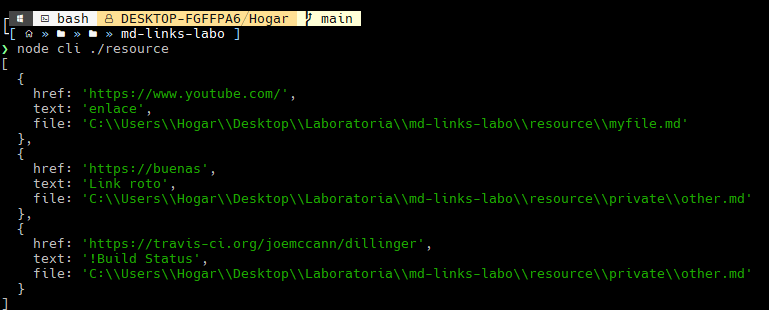
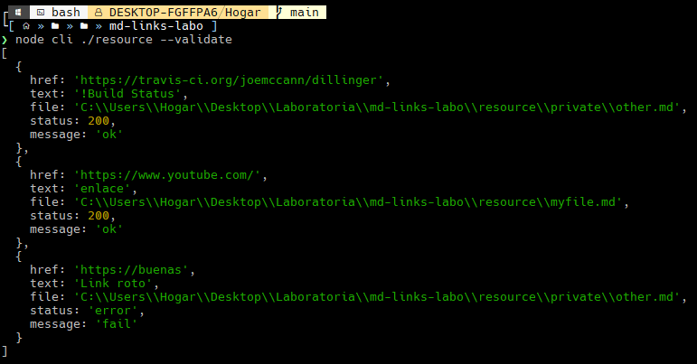
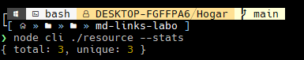
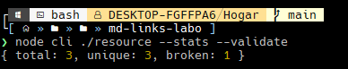
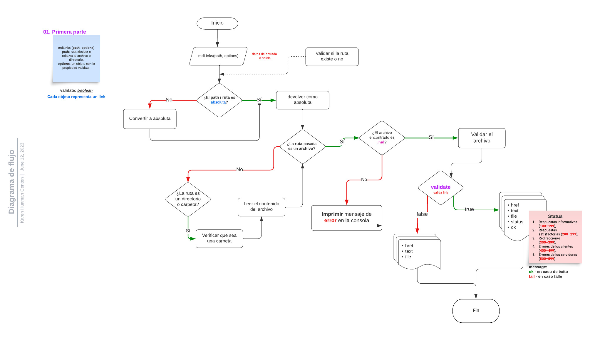
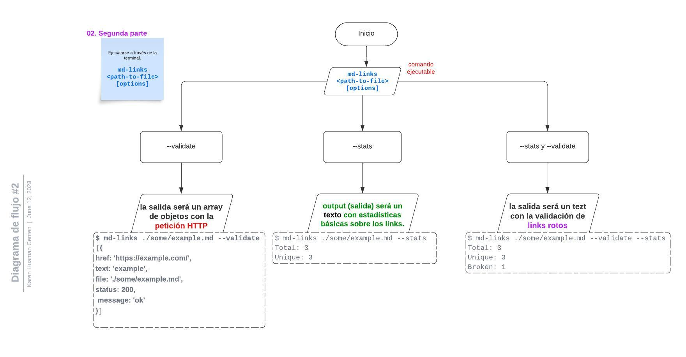

# 📎 MdLinks

## Índice

* [1. Preámbulo](#1-preámbulo)
* [2. Instalación](#2-instalación)
* [3. Guia de uso](#3-guia-de-uso)
* [4. Diagrama de flujo](#4-diagrama-de-flujo)

***


## 1. Preámbulo

[Markdown](https://es.wikipedia.org/wiki/Markdown) es un lenguaje de marcado
ligero muy popular entre developers. Es usado en muchísimas plataformas que
manejan texto plano (GitHub, foros, blogs, ...) y es muy común
encontrar varios archivos en ese formato en cualquier tipo de repositorio
(empezando por el tradicional `README.md`).

Estos archivos `Markdown` normalmente contienen _links_ (vínculos/ligas) que
muchas veces están rotos o ya no son válidos y eso perjudica mucho el valor de
la información que se quiere compartir.

Dentro de una comunidad de código abierto, nos han propuesto crear una
herramienta usando [Node.js](https://nodejs.org/), que lea y analice archivos
en formato `Markdown`, para verificar los links que contengan y reportar
algunas estadísticas.

## 2. Instalación

Ejecutar el siguiente comando:

```sh
npm install krn-links
```

## 3. Guia de uso

Ejemplo de comando a ingresar: 

```sh
krn-links ./archive/myfile.md [--validate] [--stats] 
```
#### Argumentos

* `path-user`: Ruta **absoluta** o **relativa**.
* `--validate`: Validar link encontrado
* `--stats`: Mostrar estadísticas del link

#### Valor de retorno

Con `validate:false` :

* `href`: URL encontrada.
* `text`: Texto que aparecía dentro del link.
* `file`: Ruta del archivo donde se encontró el link.

Con `validate:true` :

* `href`: URL encontrada.
* `text`: Texto que aparecía dentro del link.
* `file`: Ruta del archivo donde se encontró el link.
* `status`: Código de respuesta HTTP.
* `message`: Mensaje `fail` en caso de fallo u `ok` en caso de éxito.


### Ejemplos de ejecución

El ejecutable de nuestra aplicación debe poder ejecutarse de la siguiente
manera a través de la **terminal**:

`md-links <path-to-file> [options]`

En el resultado se analizará el archivo markdown e imprime los links que vaya encontrando, junto con la ruta del archivo donde aparece y el texto que hay dentro del link.

Por ejemplo:

```sh
$ krn-links ./resource
```




#### Options

##### `--validate`

Si pasamos la opción `--validate`, el módulo debe hacer una petición HTTP para averiguar si el link funciona o no. Si el link resulta en una redirección a una
URL que responde ok, entonces consideraremos el link como _**'ok'**_ o de lo contrario dira _**'fail'**_.

Por ejemplo:

```sh
$ krn-links ./resource --validate
```




##### `--stats`

Si pasamos la opción `--stats` el output será un texto con estadísticas
básicas sobre los links.

```sh
$ krn-links ./resource --stats
```



##### `--stats` `--validate`

También podemos combinar `--stats` y `--validate` para obtener estadísticas que necesiten de los resultados de la validación.

Por ejemplo:

```sh
$ krn-links ./resource --stats --validate
```




## 4. Diagrama de flujo


| Diagrama de md-links  |
| :----------: |
|  |

| Diagrama de cli  |
| :----------: |
|  |
